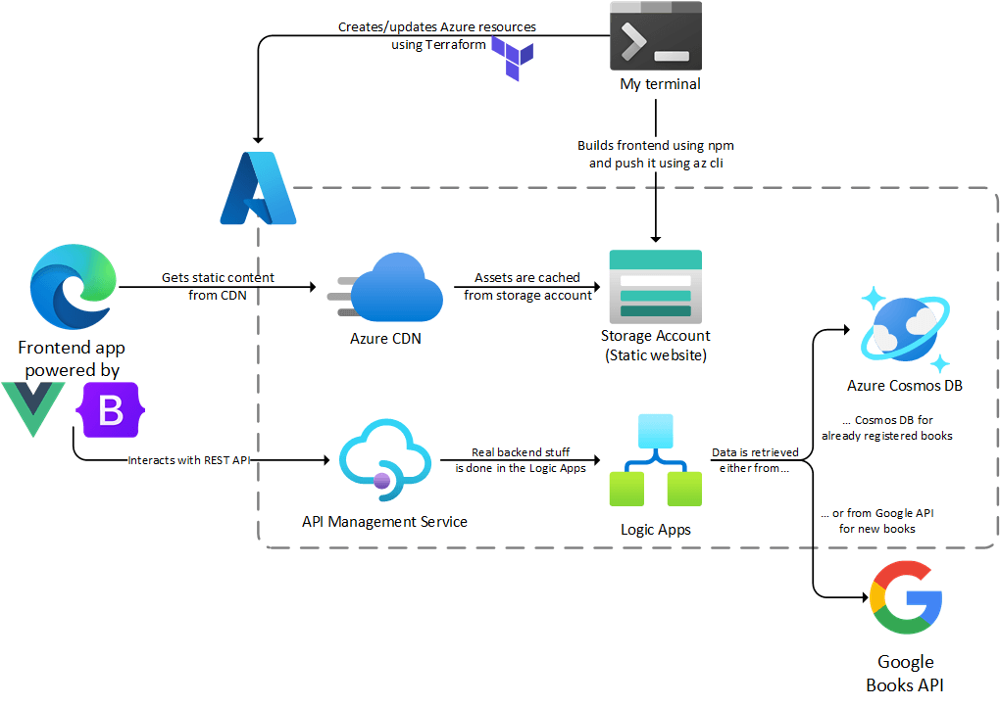

# Book Lender App

This repository will contain the code of an application designed to help small groups of people to lend books to each other.  
The project is in its very early stage of development/design, this file will be updated throughout the process.

## The story of this project

There is a story behind each application, this one came from my wife who is running an association with a couple of her friends. 
The purpose of this association is to help parents in our locality whose children have (or might have) neurodevelopmental disorders, by creating social link between the families, helping parents to get in touch with the right professionals, organizing events and many other things.  
If you want to know more about the association you can check their [Facebook page](https://www.facebook.com/parentaisesolidaire/), just beware it's in French 🥐.

The association is run by five people (let's call them 'the board members') and has a few dozen members. The board members owns several books and they often lend them to the other members.  
That's the starting point of the project, my wife asked me *"so we could track our books and who we are lending them to in a spreadsheet but maybe you can build something better for this, right ?"*  

As this sounded like a useful and nice little pet project, I ended up with the following approaches:
- Use a Power App: this is exactly what Power Apps are made for, be "better things than spreadsheets". But as Power Apps requires a Microsoft Work or School account, it will not fit with our local association
- Use a 100% serverless approach: on the other hand I could use only serverless Azure resources, so it would cost almost nothing as the traffic on the app would be very light. 

I was almost set to go for the second approach, as it was an opportunity to try Azure Static Web Apps, and to use Functions and the serverless tier of Cosmos Db in the backend.  

Then I saw this context on [DEV.to](https://dev.to/devteam/hack-the-microsoft-azure-trial-on-dev-2ne5) and thought I could use this project as a submission. It would keep me motivated to work on the project as the deadline was pretty challenging...  
The only downside was to choose a submission category, the *Computing Captains* seemed to fit as a fallback but the app was not really on computing things, and there was no category fitting my serverless approach (I think there was previous contests dedicated to serverless, that might be the reason).  

So I have finally decided to step out of my comfort zone and go for the *Low-Code Legends* category with the following idea: build a low-code backend using Azure Logic Apps and the simplest frontend ever using some Javascript and CSS framework. As mentioned earlier I could not use Power Apps for the frontend as it requires a Work or School account, even for the trial.  
I hope this choice will not void my submission to the contest, we will see 🤗

## The features of the app

Stepping aside from technical choices, let's focus on the users needs. Here is a list of MVP user stories:
- As a board member I want to track the fact that a book is lent to a user
- As a board member I want to track that a user has returned a book
- As a board member I want to list the books and who they are lent to

A big question was how the users will "interact" with the books. My wife suggested to print and stick QR codes on the books, probably because we were very into QR codes at this time, and she dedicates some of her precious free time to our local library 😊  
As there are already bar codes with the ISBN on all books, I have suggested back that the app could be able to scan these. It's way simpler and as we agreed that there is only one copy of each book it will still fit our need.

Due to my non-existent frontend skills the design of the app has to be the simplest. Just a mobile-oriented single page with big buttons to navigate between the features, and the ability to access the phone's camera to scan the bar codes on the books.

## The architecture

Back to the technical stuff, the current designed is composed of the following components:
- A simple frontend app powered by VueJs 3 and Bootstrap 5
- The static files are stored on an Azure Storage account using the Static Website feature, and served using a CDN. Why a CDN ? Because it allows the use of a custom domain through HTTPS with a managed certificate, and managed certificates are awesome !
- The frontend interacts with the "API" implemented using several Logic Apps (one for each route)
- The API calls go through an API Management in the Consumption plan, also with a custom domain and a managed certificate (currently in preview). Using the APIM bring the following features:
  - Prevents the names of the Logic Apps from being exposed
  - Handles the CORS settings
  - Defines a rate policy by API key and client, introducing a level-0 protection if someone plays too much with the API
  - Makes easier to change the backend later if I want to change the Logic Apps to a Web App or Azure Functions
- The Logic Apps interact with the data stored in a Cosmos Db free or serverless tier, and with the Google Books API to get information about the books from a ISBN code, so the users don't have to enter the titles and the author names in most cases
 
Of course as I'm very into IaC and Terraform these days, everything is deployed using Terraform, which added another layer of complexity to this project (more on this later).

I also love doing architecture diagrams so here is the one for this project:
